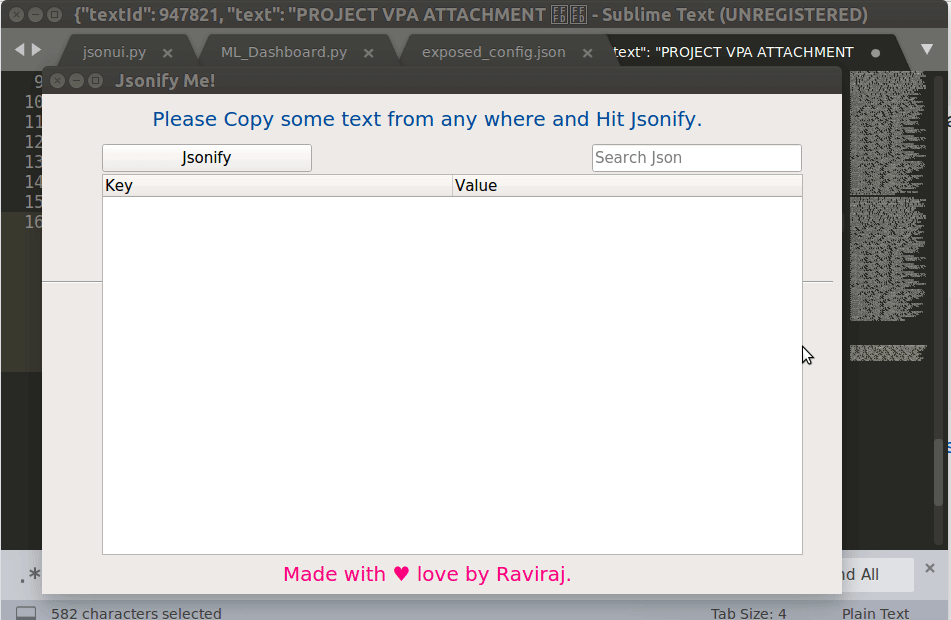

# Jsonify
Quick and Easy Json Viewer for Python.

Its a very eary to use and intutive json viewer based on python. 
Simply Copy your json string/dict from anywhere on your system, go to Jsonify window, Click Jsonify and Boom!

Features:

1. Copy form Anywhere, it takes the string from Clipboard.
2. You can search the text from Find Window for large Jsons.
3. Double click on item shows you detailed info in pop-up screen.
4. Works completey offline.

Here is a snippet of how to use it.

## Requirements 
1. PyQt5     ---- pip install fbs PyQt5==5.9.2
2. json      ---- pip install json
3. ast       ---- pip install ast
4. clipboard ---- pip install clipboard

Enjoy!!!
